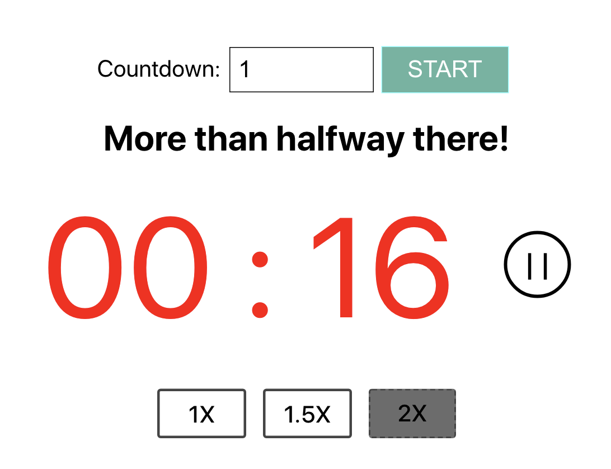

This project was built using React Hook and Styled Component as components styling.

The React framework is created using [Create React App](https://github.com/facebook/create-react-app).

## Available Scripts

In the project directory, you can run:

### `npm start`

Runs the app in the development mode. 
Open [http://localhost:3000](http://localhost:3000) to view it in the browser.

The page will reload if you make edits. 

   

## Functionalities:
Other than the specified functionalities, I added input validation that shows error when user does not enter the minutes required in the input box or fill it up with number that is not Integer.

